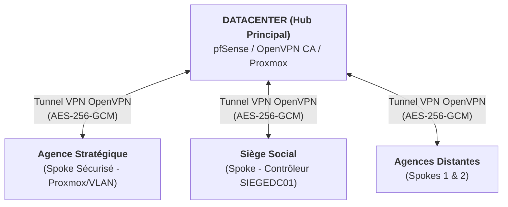
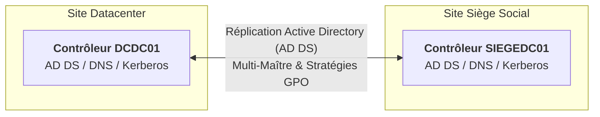
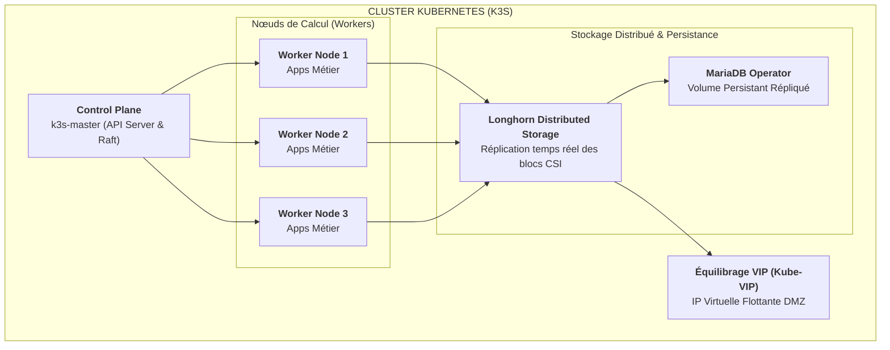

## Problématique & Contexte

Le projet d'infrastructure et de cybersécurité **EpitaCorp** consistait à concevoir, déployer et durcir l'infrastructure réseau et système complète d'une entreprise multi-sites. 

L'architecture devait garantir la haute disponibilité des services stratégiques (ERP, CRM, GED), l'isolation stricte des flux sensible (VLANs/DMZ), l'interconnexion sécurisée des agences distantes et la résilience face aux pannes matérielles.

---

## Topology & Interconnexion Hub & Spoke

L'infrastucture relie 4 entités géographiques interconnectées en topologie **Hub-and-Spoke** via des tunnels VPN chiffrés :

### Chiffrement & Autorité de Certification (PKI)

- **Gestion des certificats** : Déploiement d'une autorité de certification racine (**ROOT-CA**) sur le pare-feu du Datacenter pour la délivrance des certificats serveurs/clients X.509 et clés TLS.
- **Redondance des routeurs (CARP/VRRP)** : Paire de routeurs/pare-feux pfSense configurée en haute disponibilité avec bascule transparente des adresses IP Virtuelles (VIP) en cas de défaillance d'un nœud.

---

## Socle d'Identité & Sécurité Système

- **Active Directory (AD DS)** : Annuaire d'entreprise répliqué entre le Datacenter et le Siège social (`SIEGEDC01`, `DCDC01`), assurant la gestion centralisée des utilisateurs, la jonction de domaine, le contrôle Kerberos/LDAP et les stratégies de groupe (GPO).
- **Bastion d'accès & SIEM/EDR** : Isolation de l'administration via bastion d'accès (**Guacamole / Vault**) et journalisation centralisée des événements de sécurité sous **Wazuh SIEM**.

---

## Orchestration Cloud-Native & Stockage Distribué (Cluster K3s)

Les applications d'entreprise (Nextcloud, OrangeHRM, Dolibarr) sont orchestrées au sein d'un cluster Kubernetes léger (**K3s**) déployé sur l'infrastructure Proxmox VE :

### Composants clés du cluster K3s

- **Stockage distribué (Longhorn)** : Réplication des volumes bloc persistants en temps réel entre les nœuds workers pour éviter toute perte de données en cas de crash d'un serveur.
- **Base de données répliquée** : Déploiement d'instances MariaDB via l'opérateur K8s avec gestionnaire de stockage répliqué.
- **Haute disponibilité des entrées (Kube-VIP)** : Attribution d'une IP virtuelle flottante pour orienter les flux HTTP/HTTPS vers le sous-réseau DMZ/Frontal.

---

## Bilan & Résilience de l'Architecture

| Domaine | Implémentation | Bénéfice Sécurité & Disponibilité |
|---|---|---|
| **Réseau** | Hub-and-Spoke OpenVPN / CARP VRRP | Élimination des SPOF d'accès et interconnexion chiffrée des sites. |
| **Identité** | AD DS multi-sites (DC + Siège) | Disponibilité permanente de l'authentification et du contrôle d'accès. |
| **Applications** | Cluster K3s + Longhorn + Kube-VIP | Haute disponibilité applicative et stockage persistant autoréparant. |
| **Observabilité** | Wazuh SIEM + Grafana | Détection d'intrusions en temps réel et métrologie d'infrastructure. |
