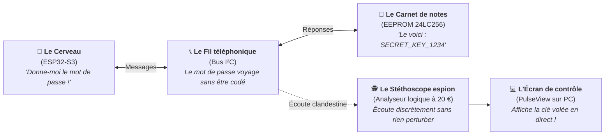
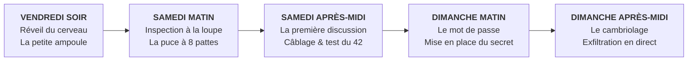

> 💡 **Deux manières de découvrir ce projet :**
> - **Vous cherchez l'audit technique d'ingénierie complet ?** Un rapport académique et industriel de 23 pages (cotation CVSS 6.8, modélisation des menaces STRIDE, chronogrammes métrologiques et contre-mesures matérielles) est disponible en téléchargement direct :  
>   📥 **[Consulter / Télécharger le Rapport Technique Complet en PDF (23 pages, 523 Ko)](/docs/rapport-lab-analyse-i2c-eeprom.pdf)**
> - **Vous voulez simplement comprendre comment ça marche sans être électronicien ?** Vous êtes au bon endroit ! Installez-vous confortablement : voici l'histoire racontée pas-à-pas, accessible à tous.

---

## 1. L'Intrigue : L'illusion de la boîte fermée

Prenez un objet électronique chez vous : une alarme de maison, un badge d'immeuble, un thermostat connecté ou même la clé électronique d'une voiture moderne.

On a naturellement tendance à penser que parce que l'appareil est enfermé dans un boîtier en plastique solide et vissé, tout ce qui se passe à l'intérieur est automatiquement secret et protégé. Beaucoup d'entreprises fabriquent d'ailleurs leurs objets en se disant : *« La boîte est fermée, personne n'ira regarder ce qui circule dedans »*.

En cybersécurité, c'est ce qu'on appelle une dangereuse illusion de sécurité (**« la sécurité par l'obscurité »**).

**La question de ce week-end d'expérimentation était simple :**  
Si un curieux muni d'un tournevis ouvre le boîtier et branche un petit appareil à moins de 25 € sur les composants électroniques, peut-il voler les mots de passe et les secrets de l'appareil en quelques secondes, sans rien casser et sans laisser la moindre trace ?

La réponse est oui. Et voici comment cela s'est passé.

---

## 2. Les Personnages de l'histoire

Pour comprendre cette expérience, nul besoin d'un diplôme d'ingénieur. Il suffit d'imaginer une conversation entre 4 acteurs très simples :

1. 🧠 **Le Cerveau (Le microcontrôleur ESP32-S3) :** C'est le chef d'orchestre de l'appareil. Une puce pas plus grande qu'un ongle qui exécute les programmes, calcule et prend les décisions. Problème : dès qu'on débranche la prise ou la pile, comme quelqu'un qui s'endort profondément, il oublie tout ce qu'il savait.
2. 📓 **Le Carnet de notes (La puce mémoire EEPROM 24LC256) :** C'est une toute petite puce noire à 8 pattes. Son rôle est de garder en mémoire les informations importantes (les mots de passe, les clés de sécurité, les réglages), même quand l'appareil est complètement éteint.
3. 📞 **Le Fil téléphonique (Le bus de communication I²C) :** Ce sont deux fines pistes en cuivre gravées sur la carte électronique qui relient le Cerveau au Carnet de notes. Quand le Cerveau a besoin d'un mot de passe, il passe un « coup de fil » au Carnet de notes en lui envoyant des signaux électriques.
4. 🕵️‍♂️ **Le Stéthoscope de l'espion (L'analyseur logique à 20 €) :** Un petit boîtier USB muni de petites pinces. Il ne coupe aucun fil et n'abîme rien : il vient juste se poser en douceur sur le fil téléphonique pour écouter discrètement les conversations, exactement comme un détective poserait un verre contre un mur.



---

## 3. Le Journal de bord : L'enquête pas-à-pas sur 1 week-end

Voici le journal de bord de l'atelier, heure par heure, du premier composant branché jusqu'à l'interception finale du mot de passe.



---

### Étape 1 (Vendredi soir) : Le réveil du cerveau & la petite ampoule

Avant de manipuler des composants délicats, la règle numéro un en électronique est de s'assurer que notre cerveau électronique (le microcontrôleur ESP32-S3) fonctionne bien et qu'il obéit à nos ordres.

Pour cela, on réalise l'équivalent du « Bonjour le monde » de l'électronique : lui ordonner d'allumer et d'éteindre une petite ampoule (une LED) toutes les secondes.

#### La répétition générale sur ordinateur (Le simulateur)
Pour être certain de ne pas griller le composant par mégarde, je commence par tester le montage sur un simulateur virtuel en ligne (*Wokwi*) :


*Répétition générale sur simulateur : l'ordinateur fait clignoter l'ampoule virtuelle sans danger.*

#### L'astuce du lab : tester les vieux outils !
Avant de brancher quoi que ce soit sur la table, un réflexe essentiel : vérifier ses fils ! Avec un multimètre en mode « bip sonore », j'ai testé mes câbles. Bien m'en a pris : deux vieux fils fatigués avaient des faux contacts invisibles à l'œil nu. Mis directement à la poubelle, ils m'ont évité des heures de casse-tête inutile !

#### Le montage réel sur table
Une fois le test virtuel validé et les câbles vérifiés, passage au monde réel sur la planche d'essai :


*Le montage réel sur table : la petite LED jaune clignote au rythme d'une seconde. Le cerveau est parfaitement réveillé !*

---

### Étape 2 (Samedi matin) : L'inspection à la loupe de la puce mémoire

Samedi matin, place à l'objectif principal : la mémoire qui va stocker nos futurs secrets. C'est un petit boîtier noir avec 8 pattes métalliques, récupéré dans mes tiroirs.


*La puce vue de très près : un circuit intégré Microchip 24LC256 capable de stocker 32 000 caractères texte sans électricité.*

En regardant les inscriptions gravées au laser sur le dessus, on découvre son identité : c'est une mémoire **Microchip 24LC256**. Elle peut retenir 32 kilo-octets (l'équivalent de plusieurs pages de texte) et conserver ces données pendant plus de 200 ans sans aucune pile !

#### La lecture du mode d'emploi du fabricant
Comme pour monter un meuble en kit, impossible de brancher cette puce au hasard sans risquer de la détruire. On consulte donc sa fiche technique officielle (*datasheet*) pour savoir à quoi sert chacune de ses 8 pattes :


*Le schéma des 8 pattes : l'alimentation électrique, la masse et les fils de discussion.*

Deux découvertes amusantes et indispensables dans cette notice :
1. **La sieste obligatoire de la puce :** Quand on demande à la puce d'enregistrer une information, elle utilise un minuscule composant interne pour piéger des électrons dans sa matière. Cette opération lui prend 5 millièmes de seconde. Pendant cette micro-sieste, elle est totalement sourde et refuse de répondre ! Il faut donc que notre programme informatique apprenne à patienter un tout petit instant après chaque écriture.
2. **Ne pas la suralimenter :** La puce aime être alimentée en 3,3 Volts. Au-delà de ses limites électriques strictes, elle grillerait immédiatement.


*Les limites de sécurité électrique indiquées dans la documentation d'origine.*

---

### Étape 3 (Samedi après-midi) : La première conversation entre le cerveau et la mémoire

Le moment est venu de faire se parler le Cerveau et la Mémoire. On les relie sur la planche d'essai à l'aide de deux fils :
- **Un fil pour les données (SDA) :** c'est par là que circulent les lettres et les chiffres.
- **Un fil pour l'horloge (SCL) :** c'est le métronome qui donne le tempo pour que les deux puces lisent les signaux exactement à la même vitesse.


*Le microcontrôleur relié aux deux fils de communication.*


*La puce mémoire câblée avec ses petites résistances qui maintiennent la tension au repos.*

#### Le test du nombre 42
Pour vérifier que la liaison fonctionne, j'écris un petit programme test :
1. Le cerveau envoie un signal pour toquer à la porte de la mémoire : *« Es-tu là ? »*
2. Il lui confie un nombre test : **42** (le fameux nombre clin d'œil de la culture geek).
3. Il coupe le contact, attend un instant, puis demande à la mémoire : *« Quel nombre t'ai-je confié tout à l'heure ? »*
4. La mémoire répond : **42** !

Le résultat s'affiche avec succès sur l'ordinateur : la mémoire retient parfaitement ce qu'on lui donne. On peut maintenant passer aux choses sérieuses !

---

### Étape 4 (Dimanche matin) : Le scénario du mot de passe secret

Dimanche matin, on transforme notre montage en un véritable équipement industriel simulé (comme un boîtier de contrôle d'accès d'un bâtiment).

Au démarrage, le cerveau écrit dans la mémoire un mot de passe top-secret :  
👉 **`SECRET_KEY_1234`**

Puis, toutes les deux secondes, le cerveau vient relire ce mot de passe dans la mémoire pour vérifier que tout est en ordre.

À partir de cet instant, **le mot de passe secret voyage en permanence sur les deux fils en cuivre de la carte électronique.** Mais personne ne peut le voir à l'œil nu... du moins pas encore !

---

### Étape 5 (Dimanche après-midi) : L'intervention de l'espion à 20 €

C'est ici que l'audit de sécurité commence. Pour intercepter ce mot de passe sans que personne ne s'en aperçoive, j'utilise un petit outil bien connu des bidouilleurs et des auditeurs en cybersécurité : un **analyseur logique USB**.

Cet outil coûte moins de 25 € sur Internet. Il dispose de petites pinces métalliques très fines :


*L'espion est en place : 3 petites pinces accrochées délicatement aux pattes de la puce, sans rien débrancher.*

L'intérêt redoutable de cet outil :
- **Il est totalement passif :** il ne consomme presque aucun courant, ne perturbe pas le signal et ne fait pas chauffer les composants.
- **Il est indétectable :** le microcontrôleur continue de fonctionner normalement, sans se douter une seule seconde que quelqu'un écoute la conversation !

#### La configuration de l'écran espion (PulseView)
Sur mon ordinateur, j'ouvre un logiciel libre appelé **PulseView**. L'appareil est instantanément reconnu :


*Sélection du pilote de l'analyseur dans le logiciel PulseView.*

Je nomme les deux canaux d'écoute : le fil de données et le fil d'horloge :


*Configuration des deux fils d'écoute dans PulseView.*

#### L'astuce du déclencheur : attraper le secret au vol
Le microcontrôleur met environ une seconde à démarrer. Si j'appuyais sur le bouton d'enregistrement manuellement, j'aurais 99 % de chances de cliquer trop tôt ou trop tard et de rater le moment précis où le mot de passe est envoyé.

**La solution :** programmer un déclencheur automatique (*trigger*). On dit au logiciel : *« Reste en veille. Dès que tu vois la toute première micro-goutte de tension sur le fil de données, commence à enregistrer immédiatement ! »*.


*Le déclencheur automatique : l'enregistrement partira tout seul à la première milliseconde d'activité.*

---

### Étape 6 (Dimanche fin d'après-midi) : L'interception et la découverte du secret

J'allume l'alimentation. En une fraction de seconde, le piège fonctionne : l'analyseur capture une rafale d'ondes électriques !


*Ce que voit la machine : des signaux électriques carrés, qui alternent entre 0 Volt et 3,3 Volts.*

Pour des yeux humains, ces créneaux électriques ne veulent rien dire : ce ne sont que des impulsions qui montent et qui descendent à toute vitesse.

Mais PulseView intègre une fonctionnalité magique : des **décodeurs de protocoles**. C'est comme brancher un interprète multilingue sur une conversation téléphonique en langue étrangère.

#### 1. Le premier traducteur (Le décodeur I²C)
On indique au logiciel que ces signaux électriques respectent les règles du protocole I²C :


*Ajout du décodeur qui regroupe les impulsions électriques en octets informatiques.*

#### 2. Le deuxième traducteur (Le décodeur spécifique à la puce mémoire)
On empile par-dessus un traducteur qui connaît par cœur le fonctionnement de notre mémoire 24LC256 :


*Le décodeur spécialisé sait exactement où se trouvent les données utiles.*

Le logiciel dessine alors des lignes d'annotations colorées au-dessus des signaux électriques :


*Les signaux électriques bruts sont maintenant traduits en blocs d'informations intelligibles.*

#### 3. Le secret apparaît sous nos yeux !
En zoomant sur les petites boîtes bleues décodées par le logiciel... surprise totale :


*La preuve en direct : le mot de passe secret apparaît lettre par lettre à l'écran !*

Chaque petit bloc électrique correspond très exactement à une lettre de notre mot de passe secret :

| Code informatique | `0x53` | `0x45` | `0x43` | `0x52` | `0x45` | `0x54` | `0x5F` | `0x4B` | `0x45` | `0x59` | `0x5F` | `0x31` | `0x32` | `0x33` | `0x34` |
| :--- | :---: | :---: | :---: | :---: | :---: | :---: | :---: | :---: | :---: | :---: | :---: | :---: | :---: | :---: | :---: |
| **Lettre lisible** | **S** | **E** | **C** | **R** | **E** | **T** | **_** | **K** | **E** | **Y** | **_** | **1** | **2** | **3** | **4** |

```text
================================================================================
                       MOT DE PASSE EXFILTRÉ EN CLAIR :
                               SECRET_KEY_1234
================================================================================
```

En moins de 5 secondes, avec un équipement à 20 € et trois petites pinces, **la clé secrète a été entièrement dérobée**, sans laisser la moindre trace visible sur l'appareil.

#### La petite curiosité du lab : le hoquet électrique
En observant de très près les signaux avec un zoom maximal, j'ai même repéré une toute petite anomalie électrique (un « glitch ») : une minuscule étincelle de bruit qui fait vaciller le signal pendant un milliardième de seconde.


*Une toute petite perturbation sur le signal. Heureusement, elle est survenue au moment où la puce ne regardait pas, sans fausser la lecture.*

---

## 4. Ce qu'il faut en retenir : La leçon pour le monde réel

Cette petite expérience de week-end illustre une réalité cruciale de la cybersécurité moderne : **un boîtier fermé ne protège rien si les composants à l'intérieur se murmurent des secrets en clair.**

Dans le monde réel, beaucoup d'équipements électroniques (bornes de recharge de voitures, compteurs connectés, traceurs de marchandises, boîtiers domotiques) ont longtemps été conçus de cette manière pour économiser quelques centimes à la fabrication. Si un individu mal intentionné a un accès physique à l'appareil pendant ne serait-ce que 5 minutes, il peut l'ouvrir, copier les clés et cloner l'équipement.

### Comment fait-on pour concevoir des objets vraiment sécurisés ?

Les ingénieurs en cybersécurité matérielle appliquent aujourd'hui ce que l'on appelle le principe du **« Zero Trust sur circuit imprimé »** : ne jamais faire confiance aux pistes en cuivre, même à l'intérieur de la machine !

1. 🔒 **Remplacer le carnet de notes par un coffre-fort numérique :**  
   Au lieu d'utiliser une puce mémoire ordinaire, on utilise un composant spécialisé appelé un **Secure Element** (c'est exactement la même technologie que la puce dorée de votre carte bancaire !). Le secret ne sort *jamais* de la puce. Si le cerveau veut vérifier l'identité, il lui pose une énigme mathématique ; la puce fait le calcul à l'intérieur d'elle-même dans son bunker blindé et renvoie juste la preuve de son calcul. Même avec des pinces, il n'y a aucun secret à écouter sur les fils !
2. 🔑 **Parler en code secret (Le chiffrement) :**  
   Si l'on doit absolument utiliser une mémoire ordinaire pour des raisons de coût, le cerveau doit chiffrer le message avant de l'envoyer. Si un espion écoute le fil téléphonique, il n'entendra qu'une bouillie de lettres incompréhensibles.
3. 🛡️ **Cacher et blinder les pistes :**  
   Sur les vraies cartes professionnelles, les fils de communication sont gravés au milieu des couches internes de la carte électronique (comme un câble sous-terrain). Impossible d'y accrocher des pinces sans percer la carte et la détruire. On peut aussi noyer la carte dans une résine noire opaque et indestructible.

---

## 5. L'Espace Technique & Rapport d'Évaluation (Pour les Spécialistes)

Pour les ingénieurs en électronique, les auditeurs en sécurité offensive et les recruteurs techniques, l'ensemble de ce travail a été consigné dans un rapport d'audit formel.

### Fiche de Synthèse d'Audit de Sécurité

| Indicateur d'Évaluation | Valeur Formelle & Spécification |
| :--- | :--- |
| **Cible d'Évaluation** | Mémoire EEPROM série I²C Microchip 24LC256 (PDIP-8, 32 Ko) |
| **Microcontrôleur Hôte** | Espressif ESP32-S3 (Xtensa 32-bit Dual-Core @ 240 MHz, DevKitC-1) |
| **Protocole & Cadence** | Bus série synchrone I²C en mode Standard (100 kHz, SDA/SCL pull-up 4,7 kΩ) |
| **Outil de Mesure** | Analyseur logique USB 8 canaux 24 MHz (Cypress FX2LP, driver libre `fx2lafw`) |
| **Logiciel d'Analyse** | Suite Sigrok / PulseView (Décodeurs empilés I²C + Microchip 24xx) |
| **Type de Vulnérabilité** | Écoute passive de bus physique sur PCB (*On-board Bus Sniffing*), non-invasive |
| **Score de Gravité CVSS v3.1** | **6.8 (Gravité Moyenne / Impact Majeur sur la Confidentialité)** |
| **Vecteur CVSS v3.1** | `CVSS:3.1/AV:P/AC:L/PR:N/UI:N/S:U/C:H/I:H/A:N` |
| **Menaces STRIDE constatées** | Information Disclosure (Critique), Spoofing (Critique), Tampering (Élevé) |

### Télécharger le Rapport Technique Complet

Le rapport officiel de 23 pages approfondit la dimension métrologique et architecturale :
- Analyse détaillée des capacités parasites et de l'adaptation d'impédance du bus I²C.
- Chronogrammes précis des temps de montée (*rise time*) et de descente (*fall time*).
- Code source complet du firmware en C++ sous PlatformIO avec gestion des registres matériels.
- Guide d'implémentation industrielle : cryptoprocesseur Microchip ATECC608A/B, NXP EdgeLock SE050, eFuses internes protégés et routage *stripline*.

👉 **[Télécharger le Rapport Technique Officiel en PDF (23 pages, 523 Ko)](/docs/rapport-lab-analyse-i2c-eeprom.pdf)**  
👉 **Code source et schémas disponibles sur mon profil [GitHub](https://github.com/piaw-cavarec)**

