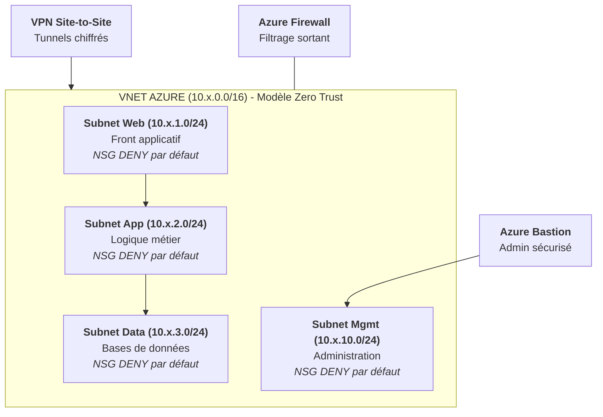

> **Avertissement :** Ce projet constitue une **étude d'architecture et un cadrage stratégique théorique** élaboré dans le cadre de la majeure SecDevOps/BuildSec à l'EPITA. La migration n'a pas été déployée techniquement en environnement de production réel.

## Problématique & Contexte

L'entreprise fictive **ECORP** (230 salariés répartis sur 2 sites principaux avec des équipements Datacenter on-premise vieillissants) souhaitait moderniser son système d'information.

L'objectif de cette étude était de concevoir le dossier d'architecture technique (HLD/LLD) et la feuille de route financière pour migrer l'ensemble des services vers le cloud **Microsoft Azure** et basculer l'annuaire historique **Active Directory (AD DS)** vers **Entra ID**, selon les principes de **sécurité par conception (*Security by Design*) et du modèle Zero Trust**.

---

## Architecture Cible & Transformation d'Identité

La stratégie privilégie une approche progressive en 2 temps (Transition hybride puis cible 100% Cloud-Only) pour éviter toute rupture de service :

```mermaid
flowchart LR
    subgraph ONPREM["Infrastructure On-Premise (Existant)"]
        direction TB
        OP1["Annuaire AD DS (Kerberos/LDAP/GPO)"]
        OP2["Serveurs Web & Bases de données"]
        OP3["Pare-feux pfSense & Stockage GlusterFS"]
        OP4["Bastion Guacamole & Vault secrets"]
        OP5["Supervision Grafana & Wazuh SIEM"]
    end

    subgraph AZURE["Architecture Cible (Cloud Azure)"]
        direction TB
        AZ1["<b>Entra ID</b> (IdP central, OAuth2/OIDC/SAML)"]
        AZ2["<b>Microsoft Intune</b> (Gestion des postes à distance)"]
        AZ3["<b>Subnets segmentés</b> (Web/App/Data/Mgmt) + NSG"]
        AZ4["<b>Azure Bastion</b> + VPN S2S + Azure Firewall"]
        AZ5["<b>Azure Backup + ASR</b> (Reprise d'activité)"]
    end

    ONPREM ==>|"Transition Hybride puis Cloud-Only"| AZURE
```

### Transformation du Modèle d'Identité (AD DS → Entra ID)

La migration de l'annuaire ne consiste pas en une simple copie, mais en une refonte complète du modèle d'accès :
- **Authentification & Accès Conditionnel** : Imposition du MFA obligatoire et règles de *Conditional Access* basées sur le risque.
- **Gestion du Parc** : Remplacement des stratégies de groupe (GPO) par **Microsoft Intune** pour le pilotage à distance des postes de travail.
- **Compatibilité Applicative** : Maintien temporaire d'*Entra Domain Services* uniquement pour les applications legacy requérant du LDAP/Kerberos.

---

## LLD Réseau & Sécurité par Défaut (Zero Trust)

L'architecture réseau Azure (`VNET 10.x.0.0/16`) applique le principe du **moindre privilège réseau (*POLP*) et du "Deny par défaut"** :

- **Passerelle VPN Site-to-Site (S2S)** : Tunnels chiffrés reliant les sites physiques à Azure.
- **Azure Bastion** : Administration à distance sécurisée sans exposition des ports RDP/SSH sur Internet.
- **Supervision & PRA** : Centralisation de la journalisation sous **Wazuh + Microsoft Sentinel** et réplication inter-région via **Azure Backup & Azure Site Recovery (ASR)** (objectifs métier : RPO 4h, RTO 2h).

---

## Modèle Économique & Chiffrage Financier (TCO 3 ans)

L'un des axes majeurs de l'étude consistait à cadrer le basculement d'un modèle **CAPEX** (achats de matériels et licences immobilisées) vers un modèle **OPEX** (consommation à l'usage prévisible).

### Synthèse du Chiffrage TCO (770 k€ sur 3 ans)

| Poste de Dépense | Détail Technique & Hypothèses | Montant Estimé |
|---|---|---|
| **BUILD (Projet)** | ~180 j/h de conseil, ingénierie, Landing Zone, VPN, tests & conduite du changement (TJM ~950 €) | **170 000 €** |
| **RUN (Année 1)** | Licences identity (M365 Business Premium + E5 admins) + Usage Azure compute/storage/network | **200 000 €** |
| **RUN (Année 2)** | OPEX récurrent | **200 000 €** |
| **RUN (Année 3)** | OPEX récurrent | **200 000 €** |
| **TOTAL TCO 3 ANS** | **Coût lissé de ~257 000 € / an** | **770 000 €** |

### Analyse des Gains & Coûts Évités

L'étude met en évidence que la justification économique repose sur un modèle mixte :
- **Renouvellement matériel Datacenter évité** : ~20 à 30 k€/an (CAPEX).
- **Contrats de maintenance & support on-prem évités** : ~12 à 15 k€/an (OPEX).
- **Électricité, climatisation & hébergement évités** : ~6 à 10 k€/an (OPEX).
- **Gains intangibles** : Réduction majeure des risques de rupture de service via la redondance multi-zones cloud.
